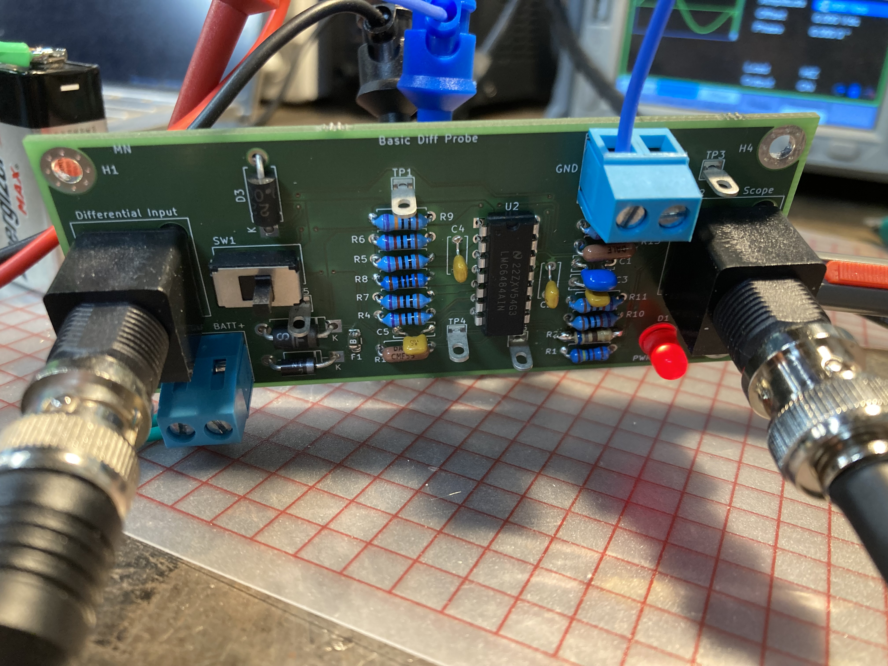
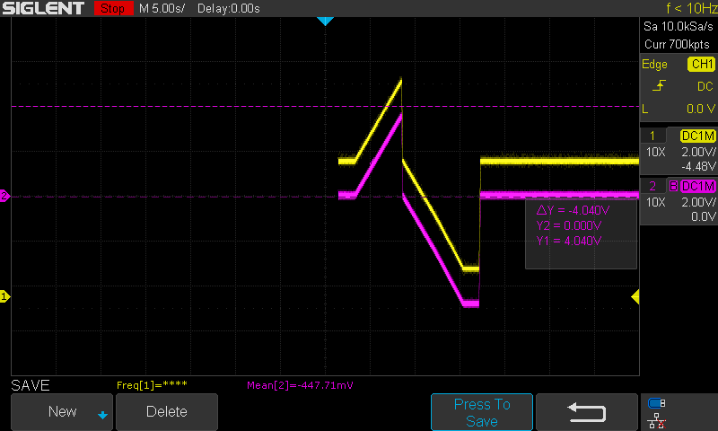

<h1> 
Basic Diff Probe 
</h1>
I need a differential probe, but I don't need particularly good specs. I don't need very high bandwidth or voltage. This is my solution. 

There are two revisions. The second revision is the same circuit board and circuit as the first revision. The only difference is a compensation
capacitor added in the feedback loop of the split supply buffer to get rid of some oscillation I was seeing.

<h3> Specs </h3>
<ul>
<li> Power Supply: 9V Battery </li>
<li> Bandwidth: 20kHz (1x) / 200Hz (10x) </li>
<li> Offset < 2mV </li>
<li> Maximum Differential Input 10x (1x): 50V (5V) </li>
<li> Minimum Differential Input 10x (1x): -50V (-5V) </li>
<li> Maximum Single Ended Input 10x (1x): 25V (2.5V) </li>
<li> Minimum Differential Input 10x (1x): -25V (-2.5V) </li>
<li> Attenuation Options: 
<ul>
    <li> 10X </li>
    <li> 1X </li>
</ul>
</li>
</ul>
<h3> Example </h3>
Here is an example measurement taken of a sweep from my curve tracer. The purple trace is from the diff probe and the yellow trace is regular single ended oscilloscope measurement.    

<h3> Possible Improvements </h3>
<ol>
<li> For some reason the bandwidth in 10x mode is very low. I'm not sure why this is. </li> 
<li> It is very hard to tell which mode the probe is in (10x or 1x) without looking at a known signal. </li>
</ol>

