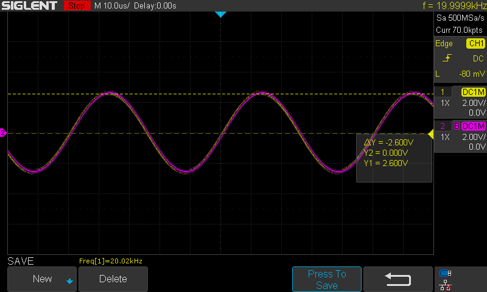
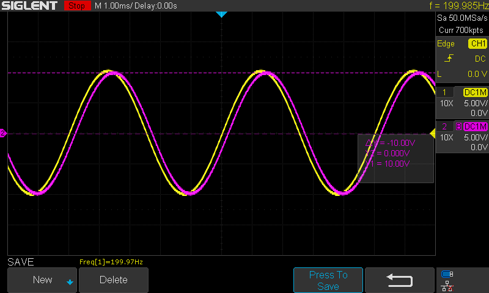
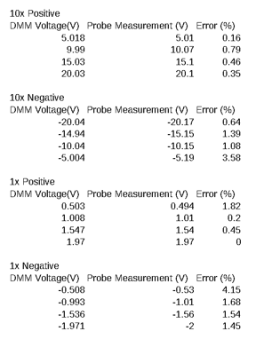

<h3>Accuracy Test</h3>

<b>Procedure:</b> Connect a function generator with a sine wave that has a frequency of 20kHz, and a peak voltage of 2.5Vp/10Vp. Connect the sine wave across the differential probe and a regular calibrated single ended scope probe. Make sure the diff probe ground is also connected. Look at both traces on the oscilloscope. Repeat for both 10x mode and 1x mode. If the diff probe sine wave is significantly distorted or attenuated decrees the frequency. This will find the bandwidth of the diff probe.

<b>Results:</b> The 1x trace is shown below:

And the 10x trace:

<b> Analysis: </b> For some reason there was significant distortion and phase shift at frequencies higher than a few hundred Hz in 10x mode. Likewise in 1x with a few hundred kHz. I'm not exactly sure why this is as the bandwidth used should be significantly based on its gain bandwidth product of the op amp. 

<h3>Floating Voltage Test</h3>

<b>Procedure:</b> Connect an isolated power supply in series with a grounded power supply. Set the grounded power supply to 5V/0.5V. Connect the differential probe across the isolated floating power supply. Increase the floating power supply voltage to 20V in 5V steps. Measure and record the floating power supply with a DMM. Record the voltage measured with the diff probe. Check the accuracy with respect to the DMM. Reverse the diff probe leads so it reads a negative voltage and repeat the test. 

<b>Results:</b> 

